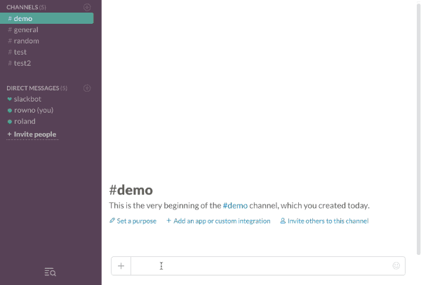

# Slack lunch shuffle

A lunch shuffle Slack bot.

Dependencies
------------

 - Node.js 4.*
 - MongoDB 2.6.*

Setup
-----

### Slack

 1. [Create a new Slack App](https://api.slack.com/apps/new), entering `https://[BASEURL]/oauth` for the Redirect URI.
 1. Go to the App Credentials page and make a note of the Client ID, Client Secret and Verification Token values. You‘ll need to enter them into the `slack` section of the server config later.
 1. Go to the Bot Users page and create a bot (can be any name you want).
 1. Go to the Interactive Messages page and set the Request URL to `https://[BASEURL]/oauth`.
 1. Go to the Slash Commands page and create a new command and set the Command to `/lunchshuffle`, Request URL to `https://[BASEURL]/command` and Usage Hint to `start | finish`.

### Server

 1. Setup server/hosting with a valid SSL certificate (Slack requires HTTPS to send events to the app).
 1. Duplicate `config.sample.yaml`, rename to `config.yaml` and change the configuration to match your setup (this is where you‘ll want to enter your Slack App‘s credentials). The config can also be specified via a `config.json` file or environment variables (e.g: `SLACK:ID`) if that‘s your jam.
 1. Upload the files to your server.
 1. Run `npm install --prod`.
 1. Start the Node server by running `node .` in the app‘s root directory.
 1. (Optional) Configure the reverse proxy server (e.g: Nginx) that‘s in-front of the Node server to serve the `app/public` directory as static files.

Usage
-----

 1. Go to the server's URL, enter the password you configured and then click Add to Slack button to authorise the bot with your Slack team.
 1. Enter `/lunchshuffle start` in any channel to start a lunch shuffle in that channel.
 1. Enter `/lunchshuffle finish` in the same channel when it‘s time for lunch to shuffle everyone that joined into their groups.
 1. Enjoy lunch with your new friends!

License
-------
Slack lunch shuffle is released under the ISC license.

Copyright © 2016, Roland Warmerdam.
